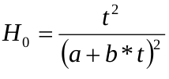

```{r setup, include=FALSE}
knitr::opts_chunk$set(echo = TRUE)
```


A lo largo de este documento nos introduciremos a la programación con R para aprender a:
- Ajustar una curva de calidad anamórfica utilizando la función Hossfled I
- Hacer gráficos con la curva guía y las distintas curvas de calidad


Si ya has utilizado R anteriormente, entonces puedes saltar al siguiente apartado, pero si eres nuevo, déjame que te explique:
- las líneas como esta, que empiezan con un "#", son comentarios. R no los interpreta, lo que permite escribir todo lo que quieras sin 
  temor a tener errores en el código.
- las líneas que NO comienzan con # son las líneas de código que se ejecutan. Debes ir ejecutando una a una, revisando en los 
  comentarios si es necesario hacer algún cambio en tu código
- R tiene algunas funciones integradas por defecto, pero necesitaremos funciones extra (llamadas librerías), que nos permitan
  tener otras utilidades m?s avanzadas, como por ejemplo hacer gráficos complejos
- lee los comentarios que he ido poniendo durante el script para saber qué haces en casa paso


## Índice de contenidos
- Carga de librerías
- Carga de datos
- Gráfico básico: dibujar y exportar
- Ajuste de curvas de calidad anamórficas utilizando el método de curva guía
- Graficar la curva guía
- Gŕaficos de Curvas de Calidad
- Superposición del análisis del árbol a las curvas de calidad


## Carga de librerías

Instalamos las librerías necesarias y las cargamos para poder utilizarlas con R.

```{r, librerías}

# lattice es una librería para realizar gráficos, más información aquí:
# https://cran.r-project.org/web/packages/lattice/lattice.pdf
ifelse('lattice' %in% installed.packages(), print('paquete lattice instalado'), 
       install.packages('lattice'))
library('lattice')

```

## Carga de datos

Ya tenemos las librerías que necesitaremos activadas, el siguiente paso será importar los datos.
Para ello lanzamos el siguiente código:

```{r}

datos_SI <- read.csv("../datos/SiteIndex.csv", # seleccionamos el nombre del archivo a importar
                    header = TRUE, # indicamos que este archivo tiene encabezados
                    sep = ";", # indicamos el ; como separador de columnas 
                    dec = ".") # y el . como separador de decimales

head(datos_SI, 10) # ahora podemos echar un vistazo a los 10 primeros datos

# del conjunto de nuestros datos vamos a seleccionar un subconjunto:
# - type == HO_Age son datos de parcelas donde la edad y la altura dominante han sido medidas
# - type == StemAnalysis son datos de parcelas donde algunos árboles fueron cortados
#           para poder conocer la edad y crecimiento anual. Con esta información es 
#           con la que se ha reconstruido el crecimiento del árbol, por lo que serán
#           los datos a utilizar

datos_SI <- subset(datos_SI, # seleccionamos nuestros datos
                  type !="H0_Age") # y eliminamos los datos que no queremos utilizar

head(datos_SI, 10) # ahora podemos echar un vistazo a los 10 primeros datos para comprobar
                  # que hemos eliminado correctamente los no deseados

```

## Gráfico básico: dibujar y exportar

A continuación vamos a representar gráficamente nuestros datos. Para ello, vamos a
explorar cómo evoluciona la altura dominante de nuestras parcelas con la edad.

```{r}

# configuración del gráfico para exportar 
#png('datos_iniciales.png', # nombre
#    width = 683, # ancho imagen
#    height = 495) # alto imagen

# graficamos los datos
xyplot(Height ~ Age, # representamos la altura respecto a la edad
       data = datos_SI, # seleccionamos nuestra base de datos
       groups = Plot, # agrupamos los datos por parcelas
       type = "l", # representamos la información con líneas
       col = "grey", # seleccionamos el color
       main = "Pinus sylvestris Alto Valle del Ebro, España", # título
       ylab = "Altura dominante (m)", # etiqueta Y
       xlab = "Edad (años)") # etiqueta X

# más información sobre la función xyplot en: 
# https://www.rdocumentation.org/packages/lattice/versions/0.10-10/topics/xyplot

```

## Ajuste de curvas de calidad anamórficas utilizando el método de curva guía

Para ilustrar el método de ajuste de curvas de calidad vamos a utilizar la ecuación
Hossfeld I, cuya estructura se muestra a continuación: 

```{r sample-image, fig.cap="(ref:sample-image)"}
 
```

donde:
  - Ho es la altura dominante (m)
  - t es la edad de la masa (años)

```{r}

# limpiamos los datos
datos_SI <- subset(datos_SI, # seleccionamos nuestros datos
                  Age != 0) # eliminamos las parcelas con edad = 0

# creamos una nueva variable necesaria para el método Hossfeld I
datos_SI$vardep <- datos_SI$Age / datos_SI$Height^0.5 

# exploramos los 10 primeros datos
head(datos_SI, 10)

# creamos la curva "guía" mediante un modelo de regresión lineal
Hossfeld.lineal <- lm(datos_SI$vardep ~ datos_SI$Age)

# comprobamos los resultados
summary(Hossfeld.lineal)

```

## Graficar la curva guía

Ahora graficaremos la curva guía previamente ajustada por regresión lineal (apartado anterior)

```{r}

# creamos una lista con 140 valores de edad
edades <- c(1:140)

# para cada valor aplicamos la fórmula Hossfeld I y obtenemos así la altura dominante
Y <- c(edades^2 / (5.731933 + 0.176904*edades)^2)

# configuración del gráfico para exportar 
#png('Curva_guia_HI.png', # nombre
#    width = 683, # ancho imagen
#    height = 495) # alto imagen

# teniendo las edades y alturas dominantes, ahora las dibujamos
plot(x = edades, # variable x
     y = Y, # variable y
     lwd = 1, 
     type = "l", # dibujamos los datos como una línea
     col = "red", # color
     lty = 1, 
     ljoin = 10, 
     main = "Curva Guía Hossfeld I", # título
     ylab = "Altura dominante (m)", # etiqueta y
     xlab = "Edad (años)") # etiqueta x

# más información sobre la función plot en: 
# https://www.rdocumentation.org/packages/graphics/versions/3.6.2/topics/plot

```

## Gŕaficos de Curvas de Calidad

En España se han definido 5 curvas de calidad diferentes para Pinus sylvestris L.
(H0 = 14, 17, 20, 23 y 26 m a la edad de referencia de 100 años). Conociendo estos valores
y fijando uno de los parámetros de la ecuación Hossfeld I como constante podemos obtener
una serie de curvas de calidad.
Por ejemplo, si fijamos la pendiente (parámetros b) como constante (0.176904) podemos obtener diferentes valores
independientes (parámetro a), uno por curva de calidad, sustituyendo el valor de la edad por nuestra edad de 
referencia (100 años) y la altura dominante por los valores conocidos de Calidad de Sitio a dicha
edad de referencia (H0 = 14, 17, 20, 23 y 26 m a la edad de referencia de 100 años). Hagámoslo:

```{r}

# vamos a definir una función cuyo contenido es la ecuación Hossfeld I donde hemos
# despejado el parámetro "a", y donde tendremos que fijar como argumentos el resto de
# variables y parámetros
parametro_a <- function(HO, Edad, b){ # función y argumentos
  a <- sqrt((Edad^2)/HO) - b*Edad # Hossfeld I para estimar "a" 
  return(a) # el resultado es la estimación del parámetro "a"
}

# además, hemos dicho que el parámetro "b" va a tener un valor constante
parametro_b <- 0.176904

# ahora que ya tenemos la función diseñada, la utilizaremos para estimar "a"
# para ello, llamamos a la función y enviamos los argumentos
HO14 <- parametro_a(14, # valor HO = 14
            100, # edad de referencia
            parametro_b) # variable b

HO17 <- parametro_a(17, 100, parametro_b) # HO = 17
HO20 <- parametro_a(20, 100, parametro_b) # HO = 20
HO23 <- parametro_a(23, 100, parametro_b) # HO = 23
HO26 <- parametro_a(26, 100, parametro_b) # HO = 26

```

Ahora que hemos calculado el parámetro "a" para las distintas calidades de sitio vamos a verlos

```{r}

print(paste("Para la calidad de sitio 14, el parámetro a tiene el valor", HO14))
print(paste("Para la calidad de sitio 17, el parámetro a tiene el valor", HO17))
print(paste("Para la calidad de sitio 20, el parámetro a tiene el valor", HO20))
print(paste("Para la calidad de sitio 23, el parámetro a tiene el valor", HO23))
print(paste("Para la calidad de sitio 26, el parámetro a tiene el valor", HO26))

```

Conociendo estos valores, ahora podemos utilizarlos para pintar las curvas de calidad
a diferentes edades

```{r}

# definimos las 5 curvas de calidad, para lo que cremos una nueva función donde
# calculamos el valor de la altura dominante de la parcela

H0_HossfeldI <- function(Edad, a, b){ # función y argumentos
  H0 <- Edad^2/(a + b*Edad)^2 # Hossfeld I para estimar "a" 
  return(H0) # el resultado es la estimación del parámetro "a"
}

# ahora que ya tenemos la función diseñada, la utilizaremos para estimar "H0"
C_14 <- H0_HossfeldI(edades, # lista de edades
            HO14, # valor HO = 14
            parametro_b) # variable b

C_17 <- H0_HossfeldI(edades, HO17, parametro_b) # HO = 17
C_20 <- H0_HossfeldI(edades, HO20, parametro_b) # HO = 20
C_23 <- H0_HossfeldI(edades, HO23, parametro_b) # HO = 23
C_26 <- H0_HossfeldI(edades, HO26, parametro_b) # HO = 26

# configuración del gráfico para exportar 
#png('Curvas_calidad-b_constante_.png', # nombre
#    width = 683, # ancho imagen
#    height = 495) # alto imagen

# de nuevo, teniendo las edades y alturas dominantes, ahora las dibujamos
plot(x = edades, # variable x
     y = C_26, # variable y
     type = "l", # dibujamos los datos como una línea
     col = "red", # color
     lty = 1, 
     ljoin = 10, 
     main = "Curvas de Calidad (b constante)", # título
     ylab = "Altura dominante (m)", # etiqueta y
     xlab = "Edad (años)") # etiqueta x

# y ahora añadimos el resto de calidades
lines(x = edades, # variable x
      y = C_23, # variable y
      lwd = 1, 
      col = "blue") # color
lines(x = edades, y = C_20, lwd = 1, col = "green")
lines(x = edades, y = C_17, lwd = 1, col = "black")
lines(x = edades, y = C_14, lwd = 1, col = "yellow")

# NOTA: ejecutar desde chunk
```

Otra alternativa a este procedimiento es fijar el término independiente (a = 5.731933) 
y modificar la pendiente para forzar a las curvas a pasar a través de las calidades
de sitio previamente definidas. Hagámoslo:

```{r}

# vamos a definir una función cuyo contenido es la ecuación Hossfeld I donde hemos
# despejado el parámetro "b", y donde tendremos que fijar como argumentos el resto de
# variables y parámetros
parametro_b <- function(HO, Edad, a){ # función y argumentos
  b <- ((sqrt((Edad^2)/HO)) - a)/Edad # Hossfeld I para estimar "b" 
  return(b) # el resultado es la estimación del parámetro "b"
}

# además, hemos dicho que el parámetro "b" va a tener un valor constante
parametro_a <- 5.731933

# ahora que ya tenemos la función diseñada, la utilizaremos para estimar "b"
# para ello, llamamos a la función y enviamos los argumentos
HO14 <- parametro_b(14, # valor HO = 14
            100, # edad de referencia
            parametro_a) # variable a

HO17 <- parametro_b(17, 100, parametro_a) # HO = 17
HO20 <- parametro_b(20, 100, parametro_a) # HO = 20
HO23 <- parametro_b(23, 100, parametro_a) # HO = 23
HO26 <- parametro_b(26, 100, parametro_a) # HO = 26

```

Ahora que hemos calculado el parámetro "a" para las distintas calidades de sitio vamos a verlos

```{r}

print(paste("Para la calidad de sitio 14, el parámetro b tiene el valor", HO14))
print(paste("Para la calidad de sitio 17, el parámetro b tiene el valor", HO17))
print(paste("Para la calidad de sitio 20, el parámetro b tiene el valor", HO20))
print(paste("Para la calidad de sitio 23, el parámetro b tiene el valor", HO23))
print(paste("Para la calidad de sitio 26, el parámetro b tiene el valor", HO26))

```


Conociendo estos valores, ahora podemos utilizarlos para pintar las curvas de calidad
a diferentes edades

```{r}

# definimos las 5 curvas de calidad, para lo que cremos una nueva función donde
# calculamos el valor de la altura dominante de la parcela
H0_HossfeldI <- function(Edad, a, b){ # función y argumentos
  H0 <- Edad^2/(a + b*Edad)^2 # Hossfeld I para estimar "a" 
  return(H0) # el resultado es la estimación del parámetro "a"
}

# ahora que ya tenemos la función diseñada, la utilizaremos para estimar "H0"
C_14 <- H0_HossfeldI(edades, # lista de edades
            parametro_a, # valor HO = 14
            HO14) # variable b

C_17 <- H0_HossfeldI(edades, parametro_a, HO17) # HO = 17
C_20 <- H0_HossfeldI(edades, parametro_a, HO20) # HO = 20
C_23 <- H0_HossfeldI(edades, parametro_a, HO23) # HO = 23
C_26 <- H0_HossfeldI(edades, parametro_a, HO26) # HO = 26

# configuración del gráfico para exportar 
#png('Curvas_calidad-a_constante_.png', # nombre
#    width = 683, # ancho imagen
#    height = 495) # alto imagen

# de nuevo, teniendo las edades y alturas dominantes, ahora las dibujamos
plot(x = edades, # variable x
     y = C_26, # variable y
     type = "l", # dibujamos los datos como una línea
     col = "red", # color
     lty = 1, 
     ljoin = 10, 
     main = "Curvas de Calidad (a constante)", # título
     ylab = "Altura dominante (m)", # etiqueta y
     xlab = "Edad (años)") # etiqueta x

# y ahora añadimos el resto de calidades
lines(x = edades, # variable x
      y = C_23, # variable y
      lwd = 1, 
      col = "blue") # color
lines(x = edades, y = C_20, lwd = 1, col = "green")
lines(x = edades, y = C_17, lwd = 1, col = "black")
lines(x = edades, y = C_14, lwd = 1, col = "yellow")

# NOTA: ejecutar desde chunk
```

## Superposición del análisis del árbol a las curvas de calidad

En caso de que queramos superponer el análisis de cada árbol a las curvas de calidad (en
este caso utilizando la ecuación de Hossfeld I con el parámetro b constante), podemos
obetener un gráfico con este contenido de la siguiente manera:

```{r}

# configuración del gráfico para exportar 
#png('arboles-calidades.png', # nombre
#    width = 683, # ancho imagen
#    height = 495) # alto imagen

# graficamos los datos
xyplot(Height ~ Age, # representamos la altura respecto a la edad
       data = datos_SI, # seleccionamos nuestra base de datos
       groups = Plot, # agrupamos los datos por parcelas
       type = "l", # representamos la información con líneas
       col = "grey", # seleccionamos el color
       main = "Análisis de tronco para Pinus sylvestris en el Alto Valle del Ebro, España", # título
       ylab = "Altura dominante (m)", # etiqueta Y
       xlab = "Edad (años)", # etiqueta X
       panel = function(x, y, ...){
       panel.xyplot(x, y, ...)
       panel.lines(x = edades, y = C_26, col = "red", lwd = 2)
       panel.lines(x = edades, y = C_23, col = "blue", lwd = 2)
       panel.lines(x = edades, y = C_20, col = "green", lwd = 2)
       panel.lines(x = edades, y = C_17, col = "black", lwd = 2)
       panel.lines(x = edades, y = C_14, col = "yellow", lwd = 2)
       }
      )
```
